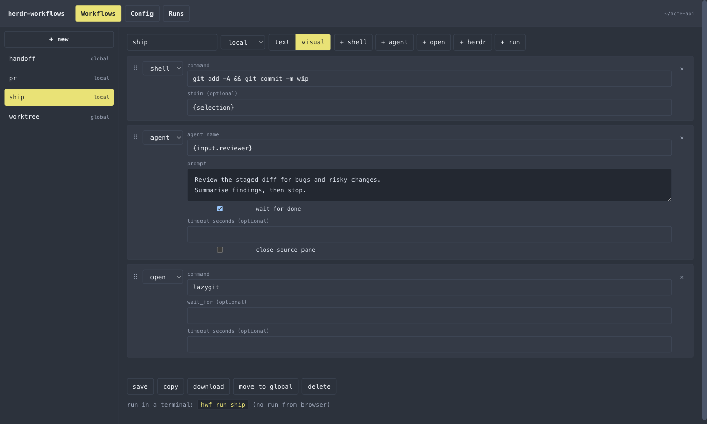

<h3 align="center">
  herdr-workflows
</h3>

<p align="center">Automate stuff in herdr</p>

<p align="center">
  <a href="https://aorumbayev.github.io/herdr-workflows/guide">Guide</a> · <a href="https://aorumbayev.github.io/herdr-workflows/examples">Examples</a> · <a href="https://aorumbayev.github.io/herdr-workflows/reference">Reference</a>
</p>

<p align="center">
  
</p>

---

herdr-workflows is a [herdr](https://herdr.dev) plugin that runs short YAML workflows — sequences of `shell`, `open`, `agent`, and `herdr` steps — from a picker (`prefix+k`), the `hwf` CLI, or a local web workbench. herdr owns panes and UI; this plugin just sequences them.

## Install

You need [herdr](https://herdr.dev) **0.7.5** or newer.

```bash
herdr plugin install aorumbayev/herdr-workflows
```

That compiles the plugin, puts `herdr-workflows` / `hwf` on your PATH, and binds `prefix+k` to the workflow picker.

Then, inside any repo:

```bash
cd your-repo
hwf init            # writes .hwf/config.yaml + a starter `review` workflow
```

Press `prefix+k` to pick and run a workflow, or use the CLI directly:

```bash
hwf run review      # run a workflow, live progress in the terminal
hwf web             # browser workbench: build/edit/validate workflows, browse run log
hwf                 # same as `hwf web`
```

Running always happens through the picker or `hwf run` — it needs real herdr panes, so the web workbench builds and shares but never runs.

## Docs

Full documentation lives at [aorumbayev.github.io/herdr-workflows](https://aorumbayev.github.io/herdr-workflows/) — [Guide](https://aorumbayev.github.io/herdr-workflows/guide) for the concepts, [Examples](https://aorumbayev.github.io/herdr-workflows/examples) for recipes, [Reference](https://aorumbayev.github.io/herdr-workflows/reference) for every rule.

## License

MIT
