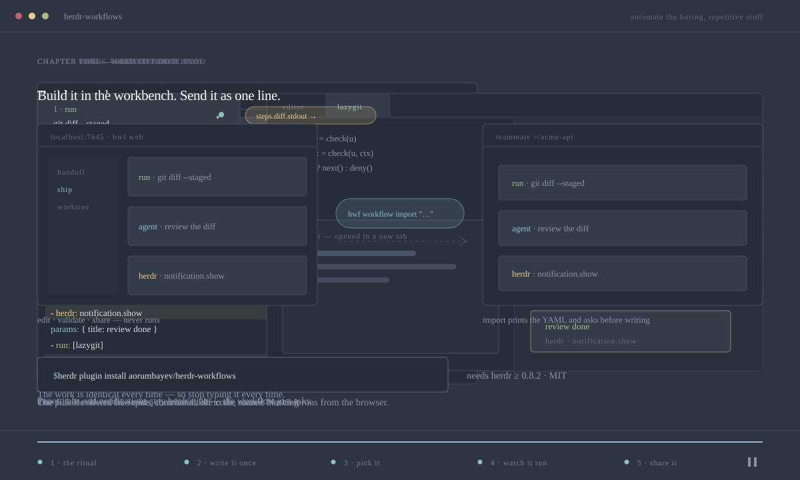

<h3 align="center">
  <br />
  herdr-workflows
</h3>

<p align="center">Automate repetitive work in herdr</p>

<p align="center">
  <a href="https://aorumbayev.github.io/herdr-workflows/">Quick start</a> · <a href="https://aorumbayev.github.io/herdr-workflows/examples">Examples</a>
</p>

<p align="center">
  
</p>

---

You have a sequence you retype every day: run the tests, read the diff, ask an agent to review it, open a pane to watch the logs. herdr-workflows lets you write that sequence once, as a short YAML file, and start it from a hotkey.

It's a plugin for [herdr](https://herdr.dev). A workflow is a list of steps that run in order. Each step does one of four things:

| Step        | What it does                                        |
| ----------- | --------------------------------------------------- |
| `run:`      | Runs a local command and captures its output        |
| `agent:`    | Starts a coding agent, sends a prompt, waits for it |
| `herdr:`    | Calls one herdr API method                          |
| `workflow:` | Runs another workflow as a child                    |

```yaml
# .hwf/workflows/review.yaml
version: v1alpha1
steps:
  - id: diff
    run: [git, diff, HEAD]
  - agent: |
      Review this diff. Blocking issues only.

      {{steps.diff.stdout}}
    using: claude
    when: "{{steps.diff.stdout}}"
    pane:
      open: beside
```

That workflow reads your diff, then opens Claude in a split pane and asks it to review the diff. It skips the review when the diff is empty. Press `prefix+k` to run it.

> [!IMPORTANT]
> A workflow file is code you're choosing to run, like a shell script in your repo. There's no sandbox. A `run:` step can do almost anything you can do within herdr manually. Read a workflow before you run it, especially one somebody shared with you.

## Install

You must have [herdr](https://herdr.dev) 0.8.2 or later on Linux or macOS. On Windows, install herdr and this plugin in WSL2. Go is not necessary on the target host.

```bash
herdr plugin install aorumbayev/herdr-workflows
cd your-repo
hwf init
```

`hwf init` finds the agents on your `PATH` and writes them into `.hwf/config.yaml` as profiles, so a workflow can say `using: claude`.

For build details, PATH setup, and updates, see [Quick start](https://aorumbayev.github.io/herdr-workflows/#install).

## Write your first workflow

Save this as `.hwf/workflows/scratch.yaml`:

```yaml
version: v1alpha1
steps:
  - run: [lazygit]
    pane:
      open: tab
    background: true
```

Press `prefix+k`, type `scratch`, then press Enter. A lazygit tab opens.

Workflows live in `.hwf/workflows/` for one repo, or `~/.hwf/workflows/` for every repo.

## Ways to work

| Command or key   | What it's for                                                                          |
| ---------------- | -------------------------------------------------------------------------------------- |
| `prefix+k`       | Pick and run a workflow. `Ctrl+K` opens the actions palette                            |
| `hwf run <name>` | Run from a terminal or a script, with `--input name=value`                             |
| `hwf web`        | Build, edit, share, and import workflows. Manage configuration and inspect run history |
| `hwf update`     | Install the latest published release                                                   |
| `hwf help`       | List every command                                                                     |

Run workflows from the picker or with `hwf run`. Runs need real herdr panes. The workbench edits and shares workflows, manages configuration, and inspects run history. It never runs workflows.

## Build workflows with your agent

Two agent skills ship inside the CLI, so there is no separate install step — an agent with `hwf` on `PATH` reads a skill through `hwf skills show`:

- `herdr-workflow-create` — interviews you, writes v1alpha1 YAML, keeps the workbench canvas in sync, and validates through the real loader before saving
- `herdr-workflow-upgrade` — brings a repo's existing workflows up to date with the latest herdr, behind version gates and a load oracle

```bash
hwf skills list
hwf skills show herdr-workflow-create
```

Or paste this to your agent and let it do the setup:

```
Set up the herdr-workflows toolkit so you can build workflows for me:

1. If `hwf` is not on PATH: herdr plugin install aorumbayev/herdr-workflows
2. Read the bundled authoring skill with `hwf skills show herdr-workflow-create` and follow
   the authoring workflow it describes.
3. In this repo: run `hwf init` if .hwf/config.yaml is missing, then start the workbench in
   the background with `hwf web --no-open` and give me the URL it prints.
4. Build a small test workflow — one `run: [git, status, --short]` step — save it, send me
   <url>#w=repo:<name>, and confirm the canvas draws it. Then interview me for the real one.
```

## Docs

- [Main documentation](https://aorumbayev.github.io/herdr-workflows/)
- [Contributing](CONTRIBUTING.md)

## License

MIT
