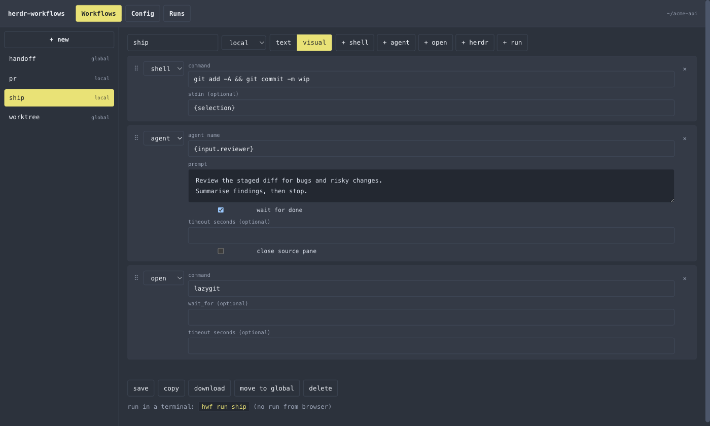

<h3 align="center">
  herdr-workflows
</h3>

<p align="center">Automate the boring and repetitive stuff in herdr</p>

<p align="center">
  <a href="https://aorumbayev.github.io/herdr-workflows/guide">Guide</a> · <a href="https://aorumbayev.github.io/herdr-workflows/examples">Examples</a> · <a href="https://aorumbayev.github.io/herdr-workflows/reference">Reference</a>
</p>

<p align="center">
  
</p>

---

herdr-workflows is a [herdr](https://herdr.dev) plugin that runs short linear YAML workflows — `run:`, `agent:`, `herdr:`, and `workflow:` — from a picker (`prefix+k`), the `hwf` CLI, or a local web workbench. herdr owns panes and UI; this plugin sequences steps. Format is `version: v1alpha1`.

```yaml
# .hwf/workflows/review.yaml
version: v1alpha1
steps:
  - id: diff
    run: [git, diff, HEAD]
  - agent: |
      Review this diff. Blocking issues only.

      {{steps.diff.stdout}}
    using: claude
    when: "{{steps.diff.stdout}}"
    pane:
      open: beside
```

Workflow YAML is reviewed executable code. There is no sandbox: a trusted `run:` can invoke the whole Herdr CLI or socket as your user. The method denylist only blocks accidental misuse of server/plugin/identity APIs.

## Install

You need [herdr](https://herdr.dev) **0.7.5** or newer.

```bash
herdr plugin install aorumbayev/herdr-workflows
```

That compiles the plugin, puts `herdr-workflows` / `hwf` on your PATH, and binds `prefix+k` to the workflow picker.

Then set up profiles:

```bash
cd your-repo
hwf init            # team / repo-local: writes .hwf/config.yaml
hwf init --global   # personal: writes Herdr plugin config dir (for ~/.hwf/workflows)
```

Both probe PATH for the kinds they know (`claude`, `codex`, `aider`, `cursor`, `opencode`) and write
one profile per kind, with the first as `default_profile`. Use repo init for shared team config; use
`--global` when you run workflows from `~/.hwf/workflows` without a per-repo `.hwf`. A profile is what a
workflow's `using:` names, so add role-oriented ones with startup `args` when a single kind should back
several roles:

```yaml
# .hwf/config.yaml  (or the global plugin config.yaml)
profiles:
  claude:
    kind: claude
  deep-review:
    kind: claude
    args: ["--model", "opus"]
default_profile: claude
```

Config merges global (Herdr's plugin config dir) → committed `.hwf/config.yaml` → gitignored
`.hwf/config.local.yaml`, replacing whole entries by name, so you can repoint a shared profile per machine.

Ready-made workflows live in [`examples/`](examples) and on the
[Examples page](https://aorumbayev.github.io/herdr-workflows/examples), where each card copies a
`hwf workflow import "<base64>"` command — it prints the YAML (with sensitive flags), asks for review,
then asks for this repo's `.hwf/workflows` or your global `~/.hwf/workflows`.

Press `prefix+k` to pick and run a workflow, or use the CLI:

```bash
hwf run review      # run the workflow above, live progress in the terminal
hwf web             # browser workbench: build/edit/validate workflows, browse run log
hwf                 # same as `hwf web`
```

Running always happens through the picker or `hwf run` — it needs real herdr panes, so the web workbench builds and shares but never runs.

## Agent skill

`skills/herdr-workflow-create` walks you through authoring a v1alpha1 workflow, keeps the web workbench canvas drawing it, and validates against this plugin's loader before saving:

```
Install the herdr-workflows toolkit so you can build workflows for me:

1. If `hwf` is not on PATH: herdr plugin install aorumbayev/herdr-workflows
2. Install the skill for this agent:
   npx -y skills add aorumbayev/herdr-workflows --skill herdr-workflow-create -y
3. Read the installed herdr-workflow-create/SKILL.md so you know the authoring workflow.
4. In this repo: run `hwf init` if .hwf/config.yaml is missing, then start the workbench in
   the background with `hwf web --no-open` and give me the URL it prints.
5. Build a small test workflow — one `run: [git, status, --short]` step — save it, send me
   <url>#w=repo:<name>, and confirm the canvas draws it. Then interview me for the real one.
```

Or install it by hand:

```bash
npx -y skills add aorumbayev/herdr-workflows --skill herdr-workflow-create -y
```

## Docs

- [Guide](https://aorumbayev.github.io/herdr-workflows/guide)
- [Examples](https://aorumbayev.github.io/herdr-workflows/examples)
- [Reference](https://aorumbayev.github.io/herdr-workflows/reference)

## License

MIT
